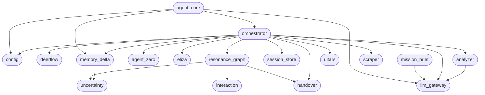

## Bağımlılık Grafiği (Dependency Graph)

### Mimari Risk Analizi (Architectural Risk Assessment)

1. **God Object Anti-Pattern:**
   Grafikte görüldüğü üzere `orchestrator` neredeyse tüm diğer servislere (analyzer, scraper, eliza, agent_zero, deerflow, uitars, session_store, handover, llm_gateway, config) doğrudan bağımlıdır (tight-coupling).
   - *Risk:* Orkestratör çok fazla sorumluluk üstlendiği için herhangi bir modülün değiştirilmesi (veya bir adımın eklenip çıkarılması) orkestratördeki akışı doğrudan etkileyecektir. "Single Responsibility Principle" (Tek Sorumluluk Prensibi) ihlal ediliyor.
   - *Çözüm:* "Event Bus (Otonom İletişim Ağı)" mimarisine (Faz 2) geçilmesi planlanmalıdır. Servisler birbirini direkt çağırmak yerine, olay (event) yayınlamalı ve dinlemelidir (Pub/Sub pattern).

2. **Döngüsel (Cyclic) Bağımlılık Riski:**
   Mevcut durumda net bir döngü görünmüyor, ancak `memory_delta`'nın `uncertainty`'e, `resonance_graph`'ın ise `uncertainty` ve `handover`'a doğrudan bağımlı olması, domain-driven (DDD) bir yapıdan ziyade katmanlar arası atlamaların (layer skipping) olduğunu gösteriyor. `orchestrator`'un da bu modülleri çağırması, veri akışını karmaşıklaştırıyor.

3. **LLM Gateway Kullanımı:**
   `llm_gateway`, `analyzer`, `agent_core` ve `mission_brief` tarafından doğrudan çağrılıyor. Merkezi bir noktada (gateway pattern) kullanılması sağlıklı ancak `agent_core` (API) katmanının `llm_gateway`'e doğrudan dokunması (`/health` için dahi olsa) API ve servis katmanları arasında sızıntıya (leakage) işaret eder.

**Sonuç:**
Sistem mevcut haliyle çalışıyor olsa da ölçeklenebilirlik ve bakım açısından darboğaza gireceği yer `Orchestrator` sınıfıdır. Bir sonraki mimari hamle, **Event Bus** yapısını entegre ederek bu sıkı bağımlılığı (tight coupling) kırmak olmalıdır.
