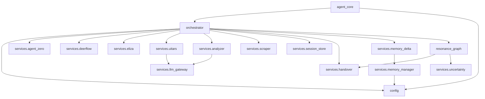

# DEPENDENCY GRAPH

## Core Module Interdependencies

### Analysis of Dependencies

1. **Circular Dependencies**: There are no strict Python circular imports at the module level. The flow is strictly top-down (entrypoint -> orchestrator -> services -> logic).
2. **Coupling**: The `orchestrator.py` is highly coupled to every specific service implementation. It explicitly imports the classes for AgentZero, DeerFlow, Eliza, etc.
3. **Gateway Isolation**: `services.llm_gateway.py` has zero dependencies on other logic services, making it perfectly isolated. Only services that actually need to make direct LLM calls (like `analyzer.py`) import the gateway. External systems like DeerFlow use HTTP configurations to call LiteLLM directly.
4. **Resonance Graph**: Depends on `services.handover` to trigger human-in-the-loop and `services.uncertainty` for deterministic rule evaluation.
