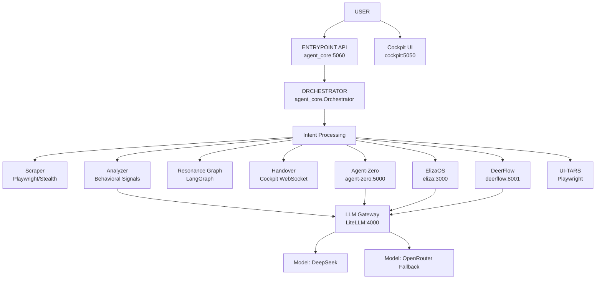

# SYSTEM MAP

## Architecture Overview

## True Data Flow

1. **USER** calls `POST /task` on `agent_core:5060`.
2. **agent_core (Orchestrator)** registers the task and calls `run_pipeline()`.
3. The pipeline conditionally activates components based on the plan:
   - **Scraper**: Grabs external user data.
   - **Analyzer**: Uses `LLMGateway` (via `chat_and_parse`) to generate a `BehavioralProfile`.
   - **Resonance Graph**: Evaluates the profile via `Uncertainty Engine` and calculates `CompatibilityVector`. Decides on `strategy`.
   - **ElizaOS**: Recalls context/persona info (`POST /:agentId/message`).
   - **DeerFlow**: Runs long-context/deep research (`POST /api/threads/{id}/runs/wait`).
   - **Agent-Zero**: Delegates complex multi-step instructions (`POST /api/api_message`).
   - **UI-TARS**: Drives browser visual agent actions (`GUIAgent`).
4. **Validation/Uncertainty Loop**: If the `Uncertainty Engine` suggests `COLLECT_MORE`, the orchestrator re-runs scraping and resonance analysis (closed feedback loop).
5. **Handover**: If `handover_ready` is true (via `evaluate_node` in resonance), it broadcasts to `Cockpit:5050/api/handover` via HTTP POST, which alerts a human.
6. **Task Finish**: Task status is recorded locally via `SessionStore`.

## Component Truths

- **agent_core**: The main coordinator (`agent_core.py`, `orchestrator.py`). Works by dispatching async requests to other microservices.
- **LLM Gateway**: All LLM requests are channeled via `services/llm_gateway.py` to LiteLLM (:4000). Gateway does token budgeting and uses a circuit breaker.
- **Resonance Graph**: Confirmed it is actually using `langgraph.graph.StateGraph` (see `resonance_graph.py`).
- **Uncertainty Engine**: Completely deterministic script (`uncertainty.py`). No LLM calls. Compares LLM confidence score versus evidence specificity (e.g. quotes, percentages).
- **Analyzer**: Enforces schema separation between observable evidence and decision making (no diagnosing mental illnesses allowed).
